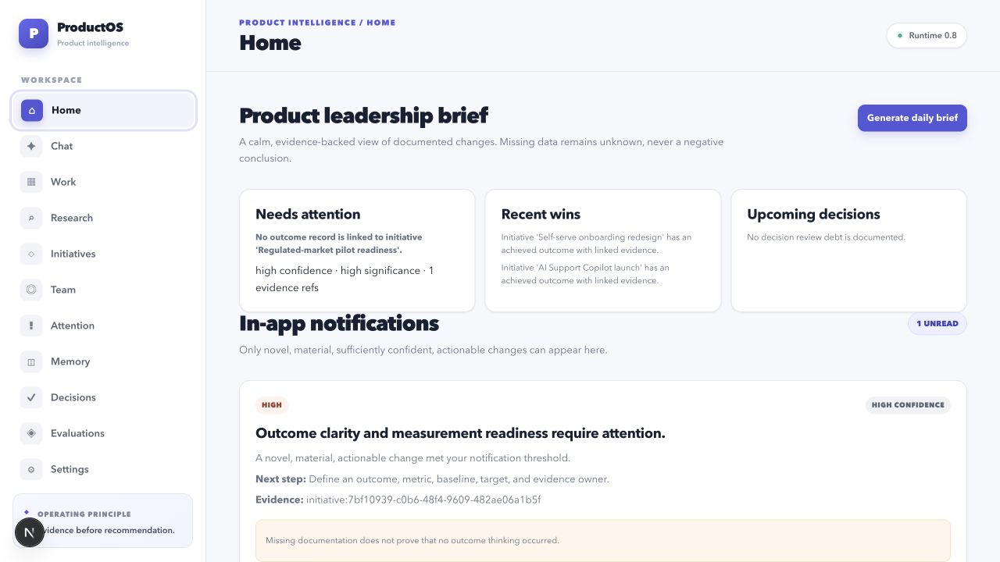
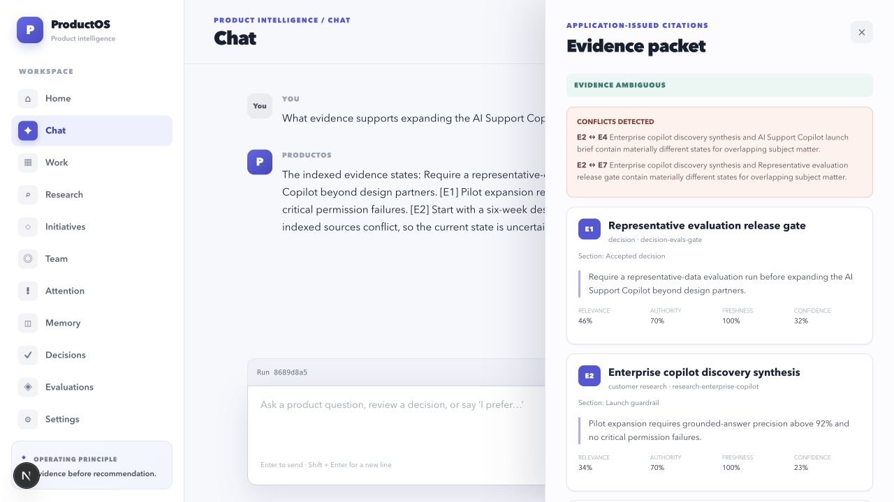
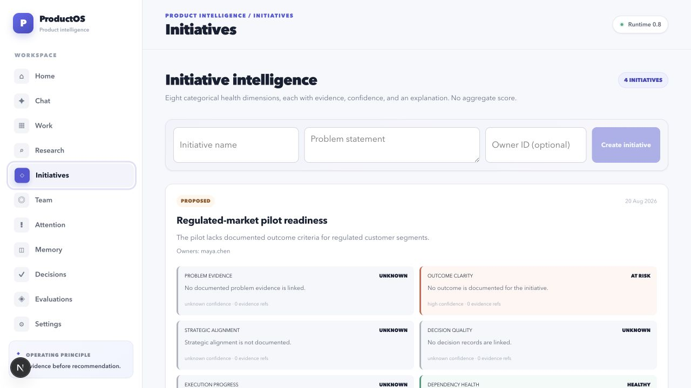
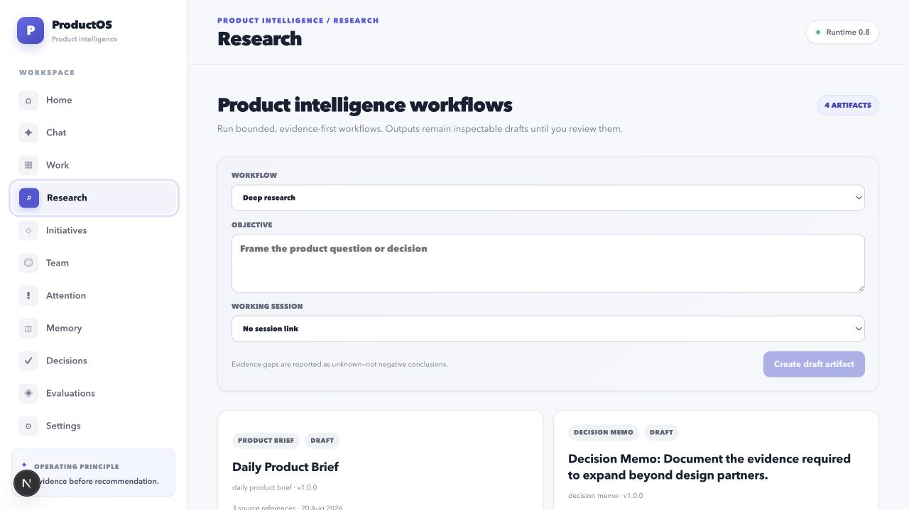

# ProductOS

ProductOS is an evidence-first AI Product Intelligence and Chief-of-Staff workspace for a Head of AI Product. It combines inspectable memory, knowledge retrieval, product workflows, management intelligence, and proactive briefs without turning workplace activity into opaque employee scores.

The repository contains all seven ProductOS V1 milestones (0–6) and the 0.8 operationalization boundary: production model adapters, OIDC claim-bound tenancy, persisted representative-data evaluations, browser PKCE login, and deployment-owned proactive scheduling.

> ProductOS is usable locally, but it is not a hosted service. Production credentials, identity-provider settings, representative company data, and deployment approval are operator-owned inputs and are intentionally not included.

## ProductOS in plain English

ProductOS is a private product-leadership workspace that helps a Head of Product understand what is happening, make better decisions, and preserve the reasoning behind those decisions.

Instead of searching through scattered documents, tickets, and prior conversations, a product leader can ask ProductOS questions such as:

- “What evidence supports this roadmap choice?”
- “What changed on this initiative, and what needs my attention?”
- “Does the implementation work match the approved product specification?”
- “What assumptions are we making, and how should we test them?”
- “Prepare an evidence-backed agenda for my next 1:1.”
- “What did we decide previously, and when should we revisit it?”

ProductOS organizes the available information, shows where each material claim came from, calls out contradictions and missing evidence, and produces draft research reports, strategy analyses, product reviews, experiment plans, and decision memos. A leader remains responsible for reviewing and approving decisions and any external action.

### A typical business workflow

1. Connect approved knowledge sources such as product documents, Jira, and Confluence.
2. Ask a question or open a working session for an initiative or decision.
3. Review the evidence, contradictions, known unknowns, and confidence shown by ProductOS.
4. Run a structured workflow—for example a PRD review, strategy analysis, experiment design, or 1:1 preparation.
5. Review and refine the resulting draft before using it in a business process.
6. Return later to inspect the decision history, updated evidence, risks, commitments, and evaluation results.

### What ProductOS does not do

- It does not know private company facts until approved sources are connected or content is added.
- It does not treat missing documentation as proof that work was not done.
- It does not rank employees or convert ticket activity into a performance score.
- It does not silently publish documents, update business systems, or send messages.
- It does not replace product judgment; it makes the evidence and reasoning easier to inspect.

The local demonstration mode is useful for exploring the workspace and workflows. Production-quality answers require an approved language model, company data, authentication, and permission-aware integrations configured by the operator.

## Product UI

ProductOS uses a light, focused workspace designed for product-leadership review. The screenshots below contain fictional sample data created only for documentation; they are not company facts and are not bundled into the application database.

### Leadership brief

The Home workspace brings documented risks, wins, upcoming decisions, and high-confidence notifications into one evidence-aware view. It explicitly preserves limitations when documentation is incomplete.



### Evidence-backed questions

Chat answers expose application-issued citations, source quality dimensions, contradictions, and known unknowns so a leader can inspect the basis of an answer before acting on it.



### Initiative intelligence

Initiatives are reviewed across categorical health dimensions such as outcome clarity, measurement readiness, dependencies, and learning velocity. ProductOS does not collapse these dimensions into an opaque score.



### Product workflows and artifacts

Research, strategy, product review, experiment, and decision workflows produce inspectable drafts with evidence references. Outputs remain drafts until a person reviews them.



## Principles

- Evidence before recommendation.
- Facts, inferences, hypotheses, recommendations, and unknowns stay distinct.
- Internal facts, citations, tool results, and outcomes are never fabricated.
- Retrieved content is untrusted and cannot override application policy.
- External reads may be autonomous; writes require explicit approval.
- Activity is not treated as product impact or PM performance.
- Management intelligence is evidence-backed and never creates employee scores.
- One application-owned runtime coordinates deterministic, observable workflows.
- Every capability is traceable and evaluatable.

The complete product and engineering contract is in [PRODUCTOS_SPEC.md](PRODUCTOS_SPEC.md).

## What is included

| Area | Capability |
| --- | --- |
| Agent runtime | Typed state, streaming responses, application-owned orchestration, structured traces |
| Persistent intelligence | Conversations, working sessions, append-only memory, provenance, conflict handling, supersession |
| Knowledge and RAG | Markdown/text ingestion, hybrid retrieval, permission filters, evidence packets, citations, contradictions |
| Atlassian | Read-only MCP boundary, Jira and Confluence normalization, current-state and spec-versus-execution workflows |
| Product workflows | Research, strategy, PRD review, spec review, experiment design, decision memos, draft artifacts |
| Management intelligence | Initiatives, outcomes, commitments, 1:1 preparation, PM reviews, portfolio attention, human corrections |
| Proactive leadership | Daily and weekly briefs, risk scans, deduplication, preferences, scoped scheduler invocation |
| Operations | OpenAI-compatible model/embedding adapters, OIDC, representative-data evaluation runner, Kubernetes CronJob |

## Architecture

```text
Next.js workspace
       |
       v
FastAPI API + OIDC boundary
       |
       v
Application-owned agent/workflow runtime
       |
       +--> Context + append-only memory
       +--> Knowledge retrieval + evidence packets
       +--> Tool registry + permission engine + MCP
       +--> Product/management/proactive workflows
       +--> Structured tracing + evaluation
       |
       v
SQLite (local) or PostgreSQL + pgvector (production)
```

Architectural decisions and milestone notes live in [docs/](docs/README.md).

## Quick start on macOS or Linux

Prerequisites:

- Python 3.12 or newer
- Node.js 20 or newer
- pnpm 9 or newer (`corepack enable` can provide it)
- Git

Clone and start the backend:

```bash
git clone https://github.com/raajitkumar24/productos.git
cd productos
python3.12 -m venv .venv
source .venv/bin/activate
python -m pip install -e '.[dev]'
uvicorn productos.api:app --reload --host 127.0.0.1 --port 8000
```

The zero-configuration development profile uses a local `productos.db`, creates its schema automatically, disables authentication, and uses deterministic model and embedding adapters. These adapters exercise the product contracts; they do not provide production-quality AI reasoning.

In a second terminal, start the web app:

```bash
cd productos/apps/web
corepack enable
pnpm install --frozen-lockfile
pnpm dev
```

Open:

- ProductOS: <http://127.0.0.1:3000>
- API documentation: <http://127.0.0.1:8000/docs>
- Health endpoint: <http://127.0.0.1:8000/health>

No `.env` file is required for this local mode. Do not copy the production-oriented `.env.example` unless you intend to configure PostgreSQL or production providers.

For frontend API or authentication overrides, copy the frontend-specific template:

```bash
cp apps/web/.env.example apps/web/.env.local
```

Next.js reads public frontend variables from `apps/web/.env.local` or from the deployment build environment. The root `.env` configures the backend and is not automatically loaded by Next.js.

## PostgreSQL development

Start PostgreSQL 16 with pgvector:

```bash
docker compose up -d postgres
cp .env.example .env
source .venv/bin/activate
alembic upgrade head
uvicorn productos.api:app --reload --host 127.0.0.1 --port 8000
```

The example database password is intentionally development-only. Replace it in any shared or deployed environment.

## API container

Build and smoke-test the same non-root API image used by CI:

```bash
docker build -f deploy/docker/api.Dockerfile -t productos-api:local .
docker run --rm -p 8000:8000 productos-api:local
```

The command above uses ephemeral SQLite demonstration storage inside the container. A production deployment must provide PostgreSQL, OIDC, model and embedding providers, HTTPS endpoints, and secret-managed credentials as described below.

## Configuration

Configuration uses environment variables with the `PRODUCTOS_` prefix. Frontend public variables use `NEXT_PUBLIC_`. See [.env.example](.env.example) for the complete template.

Important groups:

- `PRODUCTOS_DATABASE_*`: SQLite/PostgreSQL storage and schema behavior.
- `PRODUCTOS_MODEL_*`: development or OpenAI-compatible language model.
- `PRODUCTOS_EMBEDDING_*`: deterministic or OpenAI-compatible embeddings.
- `PRODUCTOS_JUDGE_*`: separately configured evaluation judge.
- `PRODUCTOS_AUTH_*` and `PRODUCTOS_OIDC_*`: production OIDC verification.
- `PRODUCTOS_ATLASSIAN_*`: read-only MCP endpoint and tool mapping.
- `NEXT_PUBLIC_*`: browser API and OIDC client settings.

Never commit `.env`, API keys, access tokens, private datasets, or local databases. Production mode validates that authentication, PostgreSQL, secure provider URLs, and production-capable model/embedding providers are configured.

## Production model providers

ProductOS uses application-owned provider interfaces. To activate an OpenAI-compatible language and embedding service, set at minimum:

```dotenv
PRODUCTOS_ENVIRONMENT=production
PRODUCTOS_MODEL_PROVIDER=openai_compatible
PRODUCTOS_MODEL_BASE_URL=https://provider.example/v1
PRODUCTOS_MODEL_API_KEY=secret-managed-value
PRODUCTOS_MODEL_NAME=your-model
PRODUCTOS_EMBEDDING_PROVIDER=openai_compatible
PRODUCTOS_EMBEDDING_BASE_URL=https://provider.example/v1
PRODUCTOS_EMBEDDING_API_KEY=secret-managed-value
PRODUCTOS_EMBEDDING_MODEL=your-embedding-model
PRODUCTOS_EMBEDDING_DIMENSION=1536
```

The base URL, model names, dimensions, and keys must match the selected provider. Inject secrets through a deployment secret manager rather than a checked-in file.

## Authentication and tenancy

Local authentication is disabled by default and uses fixed development user/tenant IDs. That mode must not be exposed publicly or connected to enterprise data.

Production requires OIDC access tokens with configured user and tenant claims. Every `/v1/*` request is bound to those verified claims; request parameters cannot widen the caller's scope. The frontend uses Authorization Code + PKCE. See [production authentication](docs/security/production-authentication.md).

## Atlassian MCP

The default application is honestly disconnected. Set `PRODUCTOS_ATLASSIAN_READ_ENABLED=true` and provide a deployment-owned Streamable HTTP MCP endpoint to enable Jira and Confluence reads. ProductOS exposes only its registered read contracts, normalizes provider payloads, and requires an explicit site choice when multiple Atlassian sites are accessible.

Authentication belongs in an approved gateway or sidecar. ProductOS does not accept or persist Atlassian tokens. External write tools are absent from V1.

## Representative-data evaluation

Static YAML catalogs provide deterministic safety and regression coverage. Production quality claims require an approved, redacted, versioned representative dataset and a separately configured judge provider. Measured runs are persisted; missing judge configuration fails honestly instead of producing a synthetic score.

See [representative evaluation operations](docs/evaluations/representative-data-operations.md) and the example dataset at [evals/representative/dataset.example.json](evals/representative/dataset.example.json).

## Proactive scheduling

ProductOS does not hide scheduling inside the web process. A deployment-owned cron invokes the scoped scheduler endpoint with a short-lived workload token carrying `productos:scheduler`. The included Kubernetes manifests are examples that must be reviewed and adapted before deployment.

See [scheduler operations](docs/operations/proactive-scheduler.md) and [the CronJob example](deploy/kubernetes/proactive-cronjob.yaml).

## Tests and quality checks

Backend:

```bash
source .venv/bin/activate
pytest
ruff check src tests
```

Frontend:

```bash
cd apps/web
pnpm typecheck
pnpm build
```

Evaluation catalogs are grouped under [evals/](evals/). Tests cover runtime behavior, authentication, memory, retrieval, MCP/Atlassian contracts, product workflows, management safety, proactive scheduling, production adapters, and representative evaluation persistence.

## Repository map

```text
apps/web/                Next.js + TypeScript workspace
src/productos/           FastAPI application, domain, runtime, providers, workflows
db/migrations/           Alembic migrations
evals/                   Golden and representative evaluation datasets
tests/                   Backend integration, contract, safety, and eval tests
docs/adr/                Architecture decision records
docs/architecture/       Milestone implementation notes
docs/security/           Authentication operations
docs/evaluations/        Representative evaluation operations
docs/operations/         Scheduler operations
deploy/                  API image and Kubernetes examples
```

## API and product surfaces

The interactive OpenAPI document at `/docs` is the source of truth for request and response schemas. Major surfaces include chat, sessions, memory, knowledge, organizational intelligence, workflows and artifacts, initiatives and management intelligence, attention, proactive briefs, traces, and evaluations.

Important semantic guarantees:

- `NO_EVIDENCE_FOUND` means no accessible matching evidence was found; it does not mean the evidence does not exist.
- `NO_EVIDENCE` in spec-versus-execution means implementation is unknown; it does not mean unimplemented.
- Decision memos remain drafts unless a user explicitly authorizes promotion.
- Management signals preserve observation, interpretation, limitations, evidence, and human corrections.
- Proactive output is a traceable draft; V1 performs no external notification delivery.

## Project status and limitations

All planned V1 milestones and the 0.8 operationalization boundary are implemented. The repository is still an early-stage reference implementation, not a turnkey enterprise deployment.

Known operator-owned work includes:

- selecting and funding production model, embedding, and judge providers;
- configuring an OIDC provider and claim mappings;
- deploying PostgreSQL/pgvector and running migrations;
- deploying an approved Atlassian MCP gateway if required;
- curating representative, permission-safe evaluation data;
- reviewing deployment manifests, secret handling, retention, monitoring, and incident response;
- performing an independent security review before connecting sensitive company systems.

## Contributing and security

See [CONTRIBUTING.md](CONTRIBUTING.md) before proposing changes. Please report vulnerabilities using [SECURITY.md](SECURITY.md), not a public issue.

## License

ProductOS is available under the [MIT License](LICENSE).
